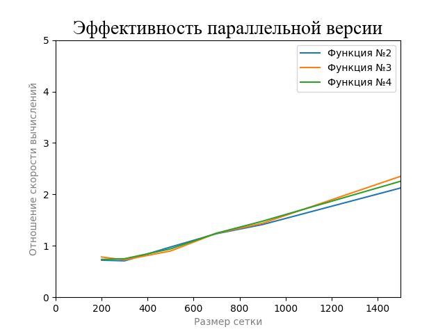
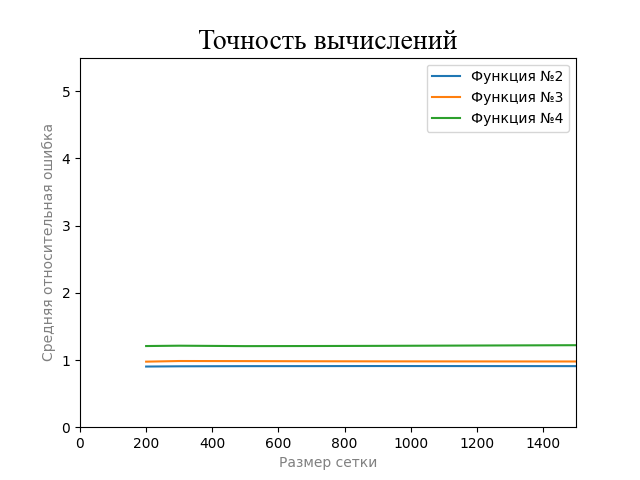

# Роль параллелизма в решении дифференциальных уравнений в частных производных

### Окружение
Вычислительное устройство под управлением ОС `Windows 10 Home` с характеристиками:
- Процессор: `AMD Ryzen 5 5500U`
  -  Общее количество ядер - 6 с масимальным числом потоков = 12
  -  Размер `L2` = 3Мб, `L3` = 16Мб
- Объем оперативной памяти: 16Гб 
- `gcc` версии 9.2.0
- Уровень оптимизации: `-O3`

## Анализ результатов
Результаты представлены в виде таблиц и графиков [здесь](results).

### Условия эксперимента

1. Множество $D$ было выбрано в соответствии с книгой: $D = {(x, y) \in D : 0 \leq x, y \leq 1}$

2. В качестве EPSILON было выбрано значение $0.001$. Такое значение позволяет более точно оценить как среднюю ошибку (в частности для функций с относительно небольшими значениями на множестве $D$), так и время работы алгоритма в обеих реализациях. Также его величина все еще позволяет проводить вычисления на сетке размером $2000$ и более.

3. Следуя расчетам из пособия, было установлено, что максимально-возожный размер блока для параллельной обработки составляет около $1200$ для одной оси,минимально-возможный - $64$. Однако, не было замечено существенного прироста в ускорении расчетов при выборе размера блока из указанного диапазона, поэтому выбор пал на $BLOCK\_SIZE=200$

4. Эмпирическим путем было установлено, что лучшие результаты в подавляющем большинстве случаев достигаются при инициализации внутренних ячеек матрицы средним арифметическим внешних (значение которых предоставляется условием задачи).

5. Функции были выбраны для демонстрации некоторых зависимостей, описанных ниже. Сейчас можно отметить что они имеют
Также для краткости введем некоторые обозначения:
  - Функция 1 : функция из книги *(нужна для сравнения некоторых характеристик с книжными)*
  - Функция 2 : $500 \times x^4 + 1500 \times y^3$ *(быстрорастущая, монотанная на $D$)*
  - Функция 3 : $\frac{1}{10} \sin(10 \times x) + \frac{1}{10} \cos({10 \times y})$ *(медленный рост, периодическая на $D$)*
  - Функция 4 : $\frac{1}{x^2 + y^2 + 0.005}$ *(монотонно убывающая на $D$)*

6. Для каждого эксперимента *(задается функцией)* была проведена серия вычислений в количестве 10 замеров. Для расчета коэффициента увеличения производительности в параллельной версии были взяты средние значения. Средняя ошибка, как и ожидалось, оказалось одинаковой для всех замеров. Также для скорости вычилений на одном и нескольких потоках были посчитаны доверительные интвервалы с уровнем доверия 95% *(ознакомиться также можно в таблице)*

### Оценка эффективности

Опираясь на результаты, представленные на графике, можно сделать ряд выводов: (относительное сравнение)
- Поскольку при волновых вычислениях блоки обрабатываются последовательно, то при маленьком размере сетки (относительно размера блока) преимущества параллельной версии нивелируются расходами на синхронизацию
- С увеличением размера сетки, как и ожидалось, параллельная версия алгоритма демонстирует заметное увеличение производительности (это начинает проявляться при размере сетки больше 700 узлов)

Учитывая данные из таблиц, можно также сказать, что: (количественное сравнение)
- На время работы сказывалось выбранное значение EPS (т.к. напрямую влияло на количество итераций), размер сетки и выбранная для аппроксимации функция. Конкретно, сильное влияние оказывало скорость изменения функции на указанном множестве и порядок ее значений (условно величина коэффициентов). Гораздо меньшее влияние оказывали свойства монотонности и периодичности.

### Оценка точности вычислений

Для начала хочется отметить, что удалось достичь воспроизводимости эксперимента для параллельных версий, то есть одинаковой с последовательной версией аппроксимацией. Это доказывает корректность модификации последовательного алгоритма.

Также был проведен анализ точности аппроксимации относительно теоретических значений функции. Для этого использовалась формула средней относительной ошибки:
$$A = \sum_{i, j \in 1..N}{|\frac{{u_{ij}-t_{ij}}}{u_{ij}}|} \times \frac{1}{N^2}$$
где $u_{ij}$ - теоретическое значение функции u в точке с координатами $(i * h, j * h)$, $t_{ij}$ - расчетное значение для той же точки (элемент в матрице с позицией $(i, j)$), $N^2$ - размер сетки.

При анализе графика можно сделать следующие выводы:
- На подавляющем большинстве функций размер сетки при фиксированном $EPS$ не оказывал никакого влияния на точность вычислений, а в некоторых случаях ошибка лишь незначительно возрастала (в пределах погрешности).
- Также для функций с меньшим порядком значений требуется гораздо меньший $EPS$ для достижения схожей точности с более "большими" функциями. Отсюда можно сделать вывод, что значение $EPS$ лучше всего вычислять динамически, опираясь например на среднее значение в граничных точках.
- Средняя ошибка была все равно достаточно велика относительно принятых норм $( < 15\% )$, что по мнению автора, обуславливается самим алгоритмом, так как необходимой точности при различных параметрах удалось достичь лишь для константы.

