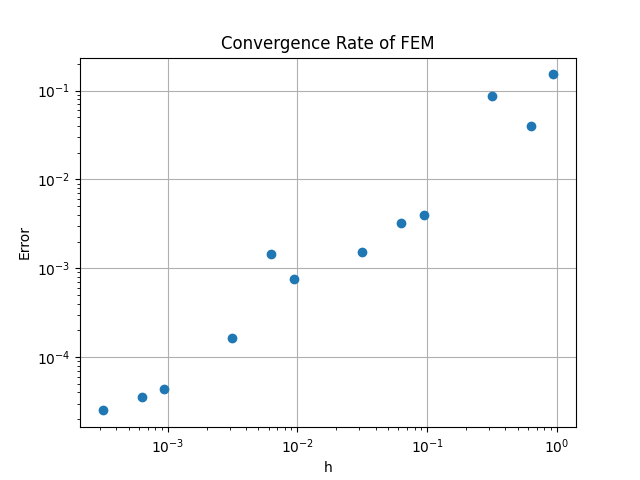

# Метод конечных элементов

### Окружение
Вычислительное устройство под управлением ОС `Windows 10 Home` с характеристиками:
- Процессор: `AMD Ryzen 5 5500U`
  -  Общее количество ядер - 6 с масимальным числом потоков = 12
  -  Размер `L2` = 3Мб, `L3` = 16Мб
- Объем оперативной памяти: 16Гб 
- python 3.11.9

## Анализ результатов

### Условия эксперимента

Оценка проводилась для уравнения $y'' - λy = -2λ * sin(\sqrt{λ}*x)$ (Вдохновлено [@osogi](https://github.com/osogi)) для промежутка $[0, \pi * n], n=1,2,..$ с граничными условиями Дирихле ($y(0) = 0$, $y(\pi * n) = 0$). Также была выбрана равномерная сетка с узлами
$i * h$, $h = B / N$, $N$ - количество узлов сетки.

Теоретическая оценка сходимости алгоритма строилась на основе пособия [Методы вычислений, Хакимзянов, Черный](http://www.ict.nsc.ru/matmod/files/textbooks/KhakimzyanovCherny-2.pdf):

> Для погрешности приближенного вычисления имеет место оценка

$$ \|y - y_h\|\_{L_2(0,l)} \leq (c'c)^2 h^2 \|f\|\_{L_2(0,l)} $$

При этом в нашем случае имеем довольно простую относительно коэффициентов оценку, ведь

$$ c' = J_M * \sqrt{P + Ql^2/4} = 1, P = sup(p(x))=1, Q = sup(q(x))=1 $$

$$ c = \frac{1}{c_1} \left( \left( Q \frac{l}{2} + P_1 \right) \frac{l}{2c_1} + 1 \right) = \frac{l}{2}+1 $$

Итого, получаем:

$$ \|y - y_h\|\_{L_2(0,l)} \leq (\frac{l}{2}+1)^2 h^2 \|2λ * sin(\sqrt{λ}*x)\|\_{L_2(0,l)} $$

### Результаты
Представлены на следующем графике 

Замеры проводились для трех разных интервалов с набором размеров сетки $[10, 100, 1000, 1000]$. Как и ожидалось, в пределах одного интервала величина ошибки линейно зависит от размера сетки. 

Также при помощи функции `check_error` проверялась оценка, описанная ранее. Замеры показали, что оценка не соблюлась только 2 раза при размере сетки, равном $10000$ (незначительное отклонение).

В конечном счете, можно утверждать, что данный метод имеет второй порядок сходимости.
