# Реализация методов аппроксимации сплайнами на Maple

### Введение

Кубические и B сплайны являются хорошими инструментами для аппроксимации и моделирования гладких кривых. В данной работе предлагается изучить особенности каджого из типа в отдельности, а также провести их общее сравнение.  
Для начала хотелось бы выписать некоторые **теоретические** ожидания от построенных сплайнов, а затем сравнить их результатами, полученными в ходе экспериментов _(и попытаться объяснить некоторые из них)_.

### Теоретические ожидания

- Оба вида сплайнов подразумевают высокую степень гладкости апроксимирующей кривой;
- Изменение одного из узлов **кубического сплайна** влияет на форму всей кривой в то время как изменение узла **B сплайна** оказывает только локальное воздействие;
- **B сплайны** предназначены для "динамической аппроксимации" и показывают лучшие свои качестве при наибольшем количестве узлов. В случае слишком маленьких сеток ожидается довольно сильное отклонение от теоретических результатов ввиду недостатка данных. В совокупности с предыдущим пунктом, можно ожидать заметные искажения сложных для аппроксимации функций;
- **Кубические сплайны** создают кривую, которая обязательно проходит через все заданные узлы данных. **B сплайны** же не всегда удовлетворяют этому условию, но аппроксимируют общую форму набора данных, создавая гладкую кривую; 

Также хотелось бы отметить некоторые преимущества B сплайнов перед кубическими, которые не получится продемонстрироват в эксперимента _(и, забегая вперед, нужно оправдать полученные результаты как-то)_

- Отличительным преимуществом **B сплайнов** является их гибкость в плане управления кривой с помощью контрольных точек, что делает их хорошим инструментом для моделирования сложных функций с локальными выбросами;
- **B сплайны** менее чувствительны к шуму данных;
- Гибкий выбор степени и прочее;

## Экспермент

*Замечание: Можно было добиться того, чтобы в B сплайне аппроксимируемые значения в граничных точках совпадали с реальным за счет увеличения степени этих точек (порядок базисных функций + 1). Однако зачастую лучший результат дает немного другой подход, при котором вместо увеличения степени граничных точек, узловой вектор расширяется дополнительными значениями с известным шагом $0.1$*

### Анализ графиков

1. $\sqrt{x}$ - Демонстрирует недостаток рассматриваемых сплайнов в виде отклонения на левой границе интервала _(для некоторых функции)_
- #### Кубический сплайн
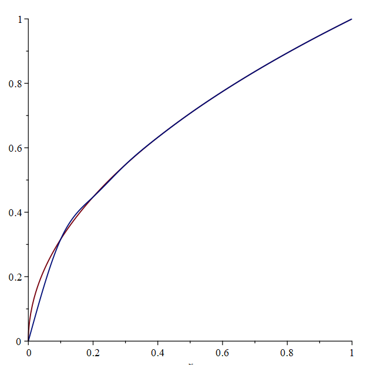
- #### B сплайн
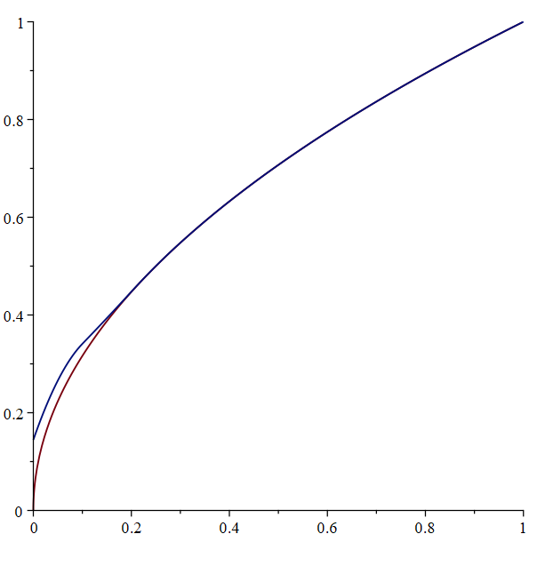

2. $\sin{(50x)}$ - демонстрация того, что для функций с высокой частотой колебаний при ограниченном количестве точек результат будет плачевным. Оба сплайна создают кривые, повторяющие форму исходной, но с гораздо меньшим периодом _(а в случае B сплайна и высота колебаний будет отличаться)_
- #### Кубический сплайн
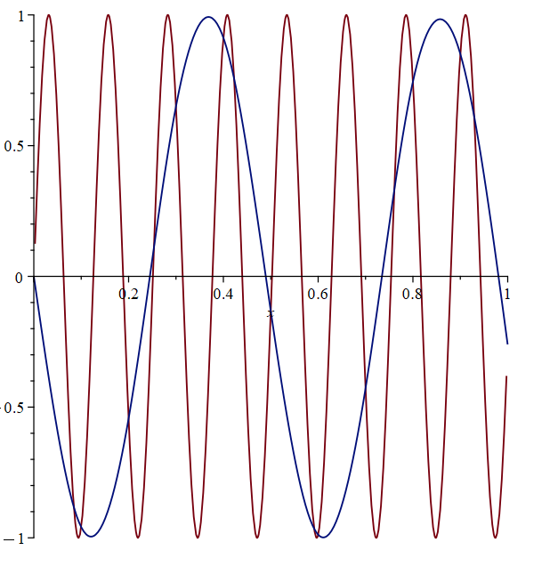
- #### B сплайн
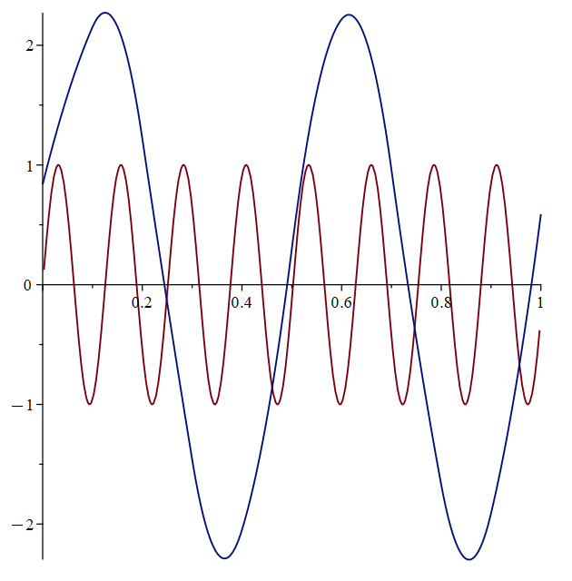

3. $\sin(20*\pi*x)$ - гиперболизированный п.2, когда из-за ограниченного и равнораспределенного вектора узлов получаем константу на исследуемом интервале
- #### Кубический сплайн
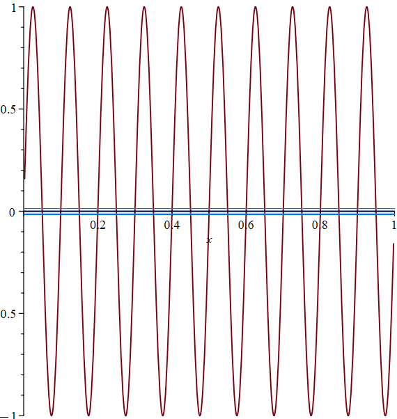
- ### B сплайн
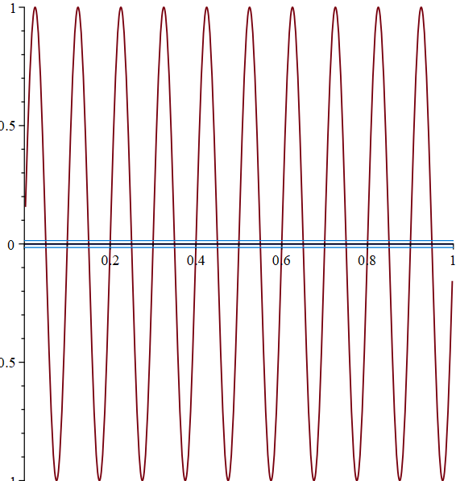

4. $\exp(\frac{1}{(x+0.4)^2})$ - характерно показывает, что размер ошибки пропорционален величине функции и что B сплайн при малом количестве контрольных узлов на некоторых функциях может вести себя заметно хуже кубического на границе интервала _(об этом было написано буквально в каждой прочитанной мной статье)_. Зато дальше, в отличие от кубического сплайна, отклонений не наблюдалось

- ### Кубический сплайн
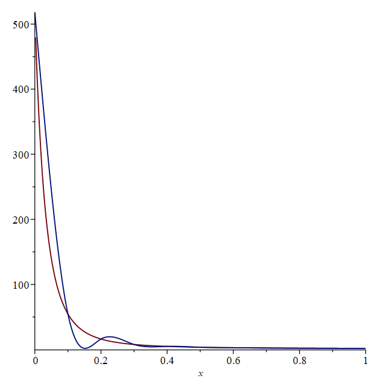

- ### B сплайн
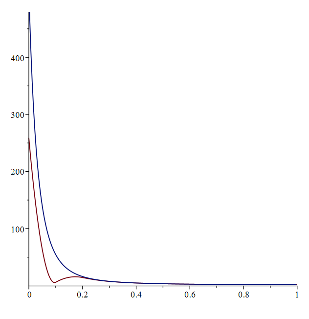

Для доказательства того, что данные сплайны способны при исходном узловом векторе качественно аппроксимировать какие то функции и что реализации алгоритмов не ошибочны, приведу несколько "хороших" примеров аппроксимации
### Удачные для аппроксимации функции

- #### $\ln(x+1)$, кубический сплайн
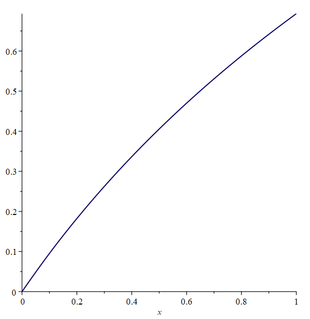

- #### $\sin(6x)$, B сплайн
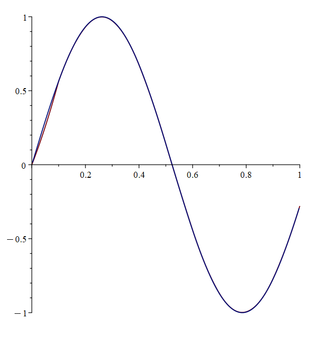

- #### $x^4$, кубический сплайн
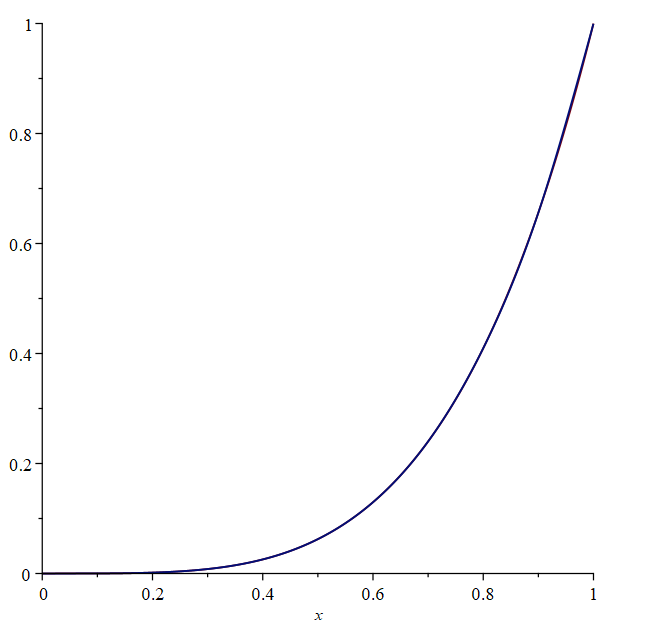

### Сравнение ошибок и оценка резульаттов

|  | Кубический сплайн | B сплайн |
| --- | --- | --- |
| $\sqrt{x}$ | 0.0690160 | 0.0725332 |
| $\sin{50x}$ | 1.9757805 | 3.2052919 |
| $\sin(20*\pi * x)$ | 0.9510564 | 0.9510565 |
| $\exp{\frac {1} {(x + 0.4) ^ 2}}$ | 125.21267 | 174.43192

Можно заметить, что в данном эксперименте лучше себя проявил кубический сплайн, что неудивительно, поскольку в этот раз никак не учитывались сильные стороны B сплайна, а на результат сильно влияли отклонения на левой границе интервала, вызванные в том числе малым количеством точек.

В целом можно сделать вывод, что при заданном наборе узлов и сравнительной метрике лучше себя демонстрирует кубический сплайн. B слусае B сплайна аппроксимирующая кривая содержит большую ошибку в левой части интервала, зато далее чуть более точно приближает исходную функцию.

### Источники вдохновения
- [Cubic Spline Interpolation, Sky McLiney and Megan Levine](https://www.rajgunesh.com/resources/downloads/numerical/cubicsplineinterpol.pdf)
- [B-Spline Interpolation on Lattices](https://www.geometrictools.com/Documentation/BSplineInterpolation.pdf)
- [Theory and Practice of Image B-Spline Interpolation](https://enpc.hal.science/hal-01846912/document)
- [Cubic Spline Interpolation](https://blog.timodenk.com/cubic-spline-interpolation/index.html)